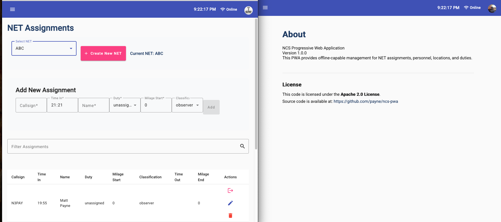

# Quick Start -- this program is not done yet!

Visit https://anet-b84b5.web.app and login with your gmail address.  For now, you must have one to use things.  Later the login will be more flexible.

[Here is a a demo of the application as of 12/6/2025](https://youtu.be/f__79srMfCM).

Here's a screen grab of the app running in both firefox and chrome.



# NCS Progressive Web Application (PWA)

A responsive Progressive Web Application built with Angular and Material Design for managing NET assignments, people (operators), locations, and duties.

## Features

- **Progressive Web App (PWA)** - Works offline, installable on devices
- **Responsive Design** - Works on desktop, tablet, and mobile devices
- **Material Design** - Clean, modern UI using Angular Material
- **Real-time Clock** - Displays current time in the top bar
- **Online/Offline Indicator** - Shows connection status
- **Navigation** - Easy-to-use hamburger menu for switching between components

## Components

1. **NET Assignments** - Manage and view NET assignments
2. **People (Operators)** - Manage operators and personnel information
3. **Locations** - Manage and view location information
4. **Duties** - Manage duty assignments and schedules
5. **About** - Application information

## Development

### Prerequisites

- Node.js (v18 or higher)
- npm (v10 or higher)

### Installation

```bash
npm install
```

### Development Server

Run the development server:

```bash
npm start
```

Navigate to `http://localhost:4200/`. The application will automatically reload if you change any of the source files.

### Build

Build the project:

```bash
npm run build
```

The build artifacts will be stored in the `dist/` directory.

### Testing the PWA

To test PWA functionality, you need to serve the production build:

```bash
# Build the project first
npm run build

# Install http-server globally if you haven't already
npm install -g http-server

# Serve the production build
http-server -p 8080 -c-1 dist/ncs-pwa/browser
```

Then navigate to `http://localhost:8080` in your browser. You should be able to:
- Install the app on your device
- Use the app offline
- See the online/offline indicator work when you toggle network connection

## Project Structure

```
src/app/
├── _services/          # Services for business logic
├── _models/            # Data models and interfaces
├── _resolvers/         # Route resolvers
├── _shared-components/ # Shared components (e.g., top-bar)
├── _guards/            # Route guards
├── _interceptors/      # HTTP interceptors
├── _test-data/         # Test and mock data
├── ncs-net-assignments/
├── ncs-people/
├── ncs-locations/
├── ncs-duties/
├── ncs-about/
└── app.ts              # Main application component
```

## Technologies Used

- **Angular 21** - Frontend framework
- **Angular Material** - UI component library
- **Angular PWA** - Progressive Web App support
- **TypeScript** - Programming language
- **RxJS** - Reactive programming

## Color Scheme

The application uses a custom color scheme defined in `src/styles.css`:
- Primary: #1e3a62
- Success: #28a745
- Warning: #fff200
- Danger: #dc3545

## License

[Apache 2.0](https://www.apache.org/licenses/LICENSE-2.0)

